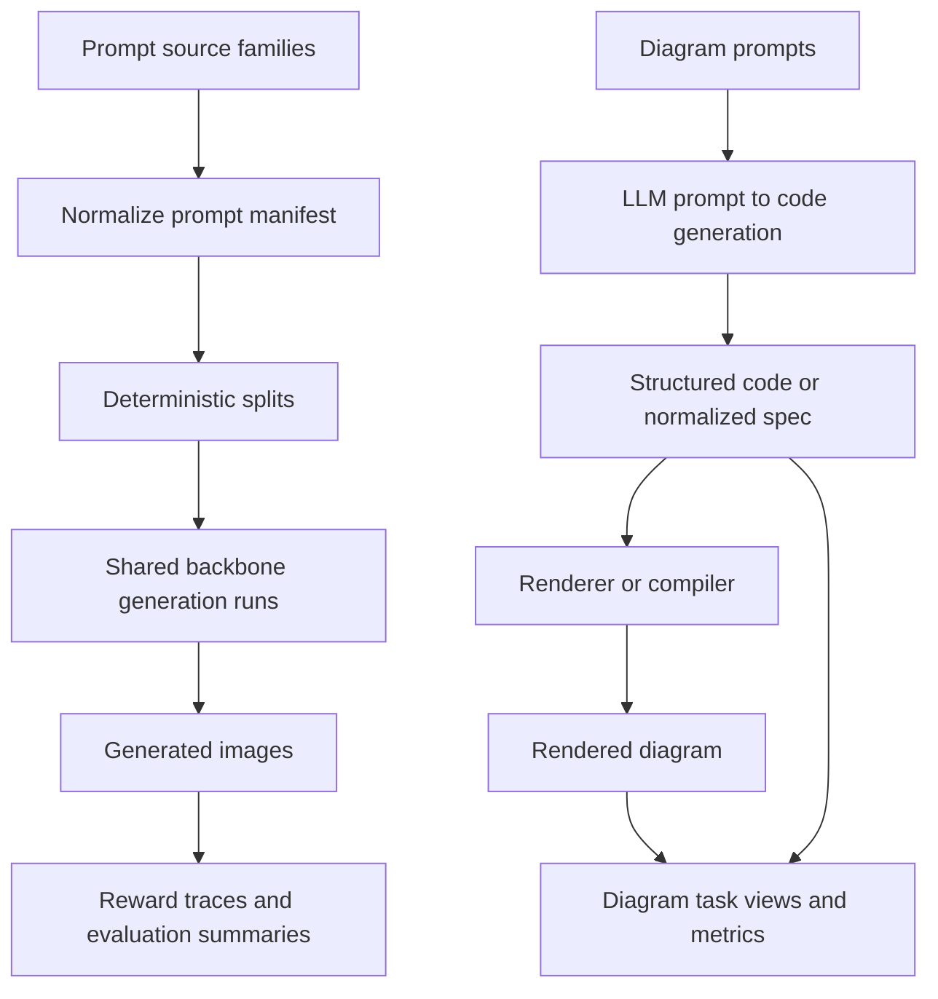

<!-- markdownlint-disable-file -->
# Task Research: Data Strategy for Clover Baselines

Define a data strategy for the repository's first research milestone: identify a common subset of data that can support baseline experiments for the diffusion-model reinforcement-learning papers referenced in README.md, while also defining a structured prompt-to-diagram dataset track for graphs and flowcharts.

## Task Implementation Requests

* Define dataset definitions for the project
* Define a dataset creation strategy for a shared baseline subset
* Define dataset inputs and outputs for training and evaluation
* Extend the strategy to cover graph, flowchart, and prompt-to-diagram data

## Scope and Success Criteria

* Scope: Research the repository structure, the baseline papers listed in README.md, and the CVPR 2025 text-to-diagram benchmark referenced for structured diagrams. Recommend a shared dataset strategy for initial baseline runs plus a prompt-to-diagram dataset strategy for graph and flowchart tasks. Excludes implementation code changes outside this research document.
* Assumptions:
  * The repository is at an early setup stage with directories already created.
  * The codebase will be incrementally built into modules, with clover/data owning shared dataset abstractions and clover/baselines owning baseline implementations.
  * The first milestone is comparability across baselines, not full-scale reproduction of every paper.
  * The project can start from a public pretrained Stable Diffusion checkpoint for RL baselines.
  * Large raw assets should be treated as external artifacts rather than committed to Git.
* Success Criteria:
  * Define candidate datasets and the role each plays.
  * Recommend one practical dataset creation strategy for a common subset.
  * Specify dataset inputs, outputs, and artifact boundaries clearly enough to guide implementation.

## Outline

* Gather codebase evidence about current data-related structure.
* Review the baseline references for data assumptions and interfaces.
* Review the CVPR 2025 text-to-diagram benchmark for graph and flowchart data implications.
* Evaluate common dataset options for text-to-image diffusion RL baselines.
* Select modular dataset tracks and document rationale, schemas, and next steps.

## Potential Next Research

* Validate exact licensing and redistribution constraints for any future paired caption-image corpus.
  * Reasoning: Stable Diffusion style pretraining requires paired text-image data, and those assets may have different storage constraints than prompt-only RL data.
  * Reference: README.md baseline paper links and dataset provider terms.
* Define the exact reward-scorer set for the first implementation pass.
  * Reasoning: The selected prompt subset is only comparable if reward recomputation is standardized.
  * Reference: DDPO, DPOK, and B2-DiffuRL reward pipelines.
* Validate released file formats and licensing for DiagramGenBenchmark or equivalent upstream diagram-code corpora.
  * Reasoning: The structured-diagram track depends on compiler-backed code artifacts, and those sources may impose different redistribution constraints than prompt manifests.
  * Reference: From Words to Structured Visuals: A Benchmark and Framework for Text-to-Diagram Generation and Editing.

## Research Executed

### File Analysis

* README.md:2 states the repository goal is training diffusion models with reinforcement learning.
* README.md:5-9 identifies the initial baseline set: B2-DiffuRL, Stable Diffusion, DDPO, and DPOK.
* pyproject.toml:4-7 is still scaffold-level, with placeholder description text and `dependencies = []`.
* main.py:2 is a stub that prints `Hello from clover!`.
* clover/utils/utils.py:3-13 contains only notebook autoreload support.
* clover/exp/b2diffurl.ipynb:11 and clover/exp/b2diffurl.ipynb:21-22 show the only active workflow is notebook-based exploration.
* clover/data/ and clover/baselines/ are currently empty, so there is no existing dataset contract to extend.

### Code Search Results

* Search result summary from subagent inspection: no loaders, manifests, reward records, preprocessing code, split definitions, or dataset schemas were found in the checked-in package.
* The controlling local fact is absence, not conflicting implementations: the data strategy needs to define the first explicit dataset abstraction for the repo.

### External Research

* Stable Diffusion / LDM requires paired text-image data for base-model training, with official SD v1 training tied to LAION-5B subsets and related caption-image corpora.
  * Source: [Stable Diffusion v1 model card](https://github.com/CompVis/stable-diffusion/blob/main/Stable_Diffusion_v1_Model_Card.md)
  * Source: [CompVis stable-diffusion repository](https://github.com/CompVis/stable-diffusion)
  * Source: [CompVis latent-diffusion repository](https://github.com/CompVis/latent-diffusion)
* DDPO assumes a pretrained text-to-image model and performs RL fine-tuning from prompts, generated images, and task-specific reward signals.
  * Source: [DDPO paper](https://arxiv.org/html/2305.13301v4)
  * Source: [DDPO project site](https://rl-diffusion.github.io/)
* B2-DiffuRL also assumes a pretrained Stable Diffusion v1.4 checkpoint and uses prompt-only candidate sets plus generated trajectories and alignment rewards.
  * Source: [B2-DiffuRL paper](https://arxiv.org/html/2503.11240v2)
  * Source: [B2-DiffuRL arXiv abstract](https://arxiv.org/abs/2503.11240)
* DPOK uses prompt-only RL fine-tuning on top of a pretrained diffusion backbone, with ImageReward or related learned reward models as the practical reward interface.
  * Source: [DPOK abstract](https://arxiv.org/abs/2305.16381)
  * Source: [DPOK repository README](https://github.com/google-research/google-research/tree/master/dpok)
  * Source: [DPOK DrawBench prompt metadata](https://github.com/google-research/google-research/blob/master/dpok/dataset/drawbench/data_meta.json)
* DiagramGenBenchmark defines a code-centered benchmark for diagram generation, diagram coding, and diagram editing across categories including flowcharts, directed graphs, undirected graphs, model architecture diagrams, and mind maps.
  * Source: [From Words to Structured Visuals: A Benchmark and Framework for Text-to-Diagram Generation and Editing](https://openaccess.thecvf.com/content/CVPR2025/papers/Wei_From_Words_to_Structured_Visuals_A_Benchmark_and_Framework_for_CVPR_2025_paper.pdf)
  * Source: [arXiv HTML](https://arxiv.org/html/2411.11916v1)

### Project Conventions

* Standards referenced: Task Researcher mode requirements.
* Instructions followed: repository-wide VS Code agent instructions and markdown exemptions for `.copilot-tracking/**`.
* File reference style inside this document uses plain-text workspace-relative paths because `.copilot-tracking/**` is intended for agent consumption.

## Key Discoveries

### Project Structure

The repository has no implemented data layer yet. The current executable surface is minimal, with notebook bootstrap code in clover/exp/b2diffurl.ipynb and notebook helper code in clover/utils/utils.py, but that should not be read as a notebook-first architecture decision.

The empty clover/data/ and clover/baselines/ directories are the strongest local signal. The intended architecture is modular: clover/data should own shared dataset contracts, loaders, manifests, provenance, and artifact schemas, while clover/baselines should own baseline-specific training and evaluation code that consumes those shared contracts.

### Implementation Patterns

The current workflow is early-stage and lightweight. That favors a manifest-first data contract that works for exploratory experimentation and for the incremental module build-out planned for clover/data and clover/baselines, without requiring a custom binary format from day one.

The baseline papers split into two data regimes:

* Stable Diffusion / LDM base training: paired text-image data is fundamental.
* DDPO, DPOK, and B2-DiffuRL RL fine-tuning: prompt lists are the raw input, while generated images and reward traces are derived outputs.

Those are different first-class data units. Treating them as one monolithic dataset from the start would add unnecessary complexity to the first milestone.

The diagram benchmark introduces a third regime:

* Prompt-to-diagram tasks for graphs and flowcharts should be code-centered, not image-centered.
* The raw artifact should preserve structured logic through an intermediate code or spec representation, then render a diagram from that code.

That means the project should plan for multiple dataset families under one shared abstraction layer rather than a single universal raw record.

### Complete Examples

```text
Canonical prompt record

prompt_id: b2_t1_dog_riding_bike_0001
prompt_text: a dog riding a bike
source_family: b2_template1
semantic_tag: activity
split: train
overlap_slice: ddpo_b2_shared
source_paper: b2diffurl_cvpr2025
notes: direct overlap with DDPO animal-activity family
```

### API and Schema Documentation

Recommended canonical raw schema for the first milestone:

* `prompt_id`: stable unique identifier for one canonical prompt record.
* `prompt_text`: the exact text sent to the diffusion pipeline.
* `source_family`: origin of the prompt family, such as `ddpo_animals`, `b2_template1`, `b2_template2`, `b2_template3`, or `dpok_drawbench`.
* `semantic_tag`: task grouping such as `activity`, `attribute`, `relation`, `color`, `count`, `text`, or `composition`.
* `split`: deterministic split label such as `train`, `eval_in_domain`, or `eval_generalization`.
* `overlap_slice`: optional marker for exact cross-paper overlap groups such as `ddpo_b2_shared`.
* `source_paper`: provenance marker for reproducibility.
* `license_note`: optional string for downstream governance.
* `metadata`: optional free-form dictionary for prompt-template fields, such as `animal`, `activity`, `object_1`, `predicate`, or `object_2`.

Recommended derived generation schema:

* `run_id`
* `prompt_id`
* `seed`
* `backbone_id`
* `adapter_id`
* `sampler`
* `num_steps`
* `guidance_scale`
* `image_uri`
* `reward_scores`: map keyed by scorer name, such as `clipscore`, `bertscore`, `imagereward`, or `aesthetic`
* `reward_metadata`: intermediate outputs such as VLM caption text when the reward path needs it

Recommended canonical raw schema for the structured-diagram track:

* `diagram_id`: stable identifier for the base diagram artifact.
* `task_type`: `generation`, `coding`, or `editing`.
* `category`: `flowchart`, `directed_graph`, `undirected_graph`, `model_architecture`, `mind_map`, or another supported category.
* `source_language`: `dot`, `tikz`, `latex`, `mermaid`, or other supported DSL.
* `prompt_id`: stable identifier for the natural-language instruction.
* `prompt_text`: natural-language description of the target diagram.
* `source_code`: canonical code or structured specification used to render the diagram.
* `normalized_spec`: optional language-agnostic IR for nodes, edges, layout hints, and labels.
* `renderer`: compiler or renderer used to create the diagram image.
* `renderer_version`: versioned rendering environment.
* `render_config`: layout engine, fonts, compile flags, and related settings.
* `rendered_uri`: pointer to the rendered diagram artifact.
* `split`: deterministic split label.
* `parent_diagram_id`: optional lineage pointer for edit tasks.
* `edit_instruction`: optional modification request for edit tasks.
* `provenance_source`: benchmark or corpus origin.
* `license_note`: upstream licensing note.
* `evaluation_metadata`: code metrics, visual metrics, and error taxonomy tags.

### Configuration Examples

```json
{
  "dataset_name": "clover_shared_rl_subset_v1",
  "canonical_unit": "prompt_record",
  "raw_manifest": "data/manifests/clover_shared_rl_subset_v1/prompts.jsonl",
  "splits": ["train", "eval_in_domain", "eval_generalization"],
  "source_families": [
    "b2_template1",
    "b2_template2",
    "b2_template3"
  ],
  "overlap_slices": [
    "ddpo_b2_shared"
  ],
  "derived_artifacts_root": "data/artifacts/clover_shared_rl_subset_v1/"
}
```

```json
{
  "dataset_name": "clover_structured_diagrams_v1",
  "canonical_unit": "diagram_artifact_record",
  "raw_manifest": "data/manifests/clover_structured_diagrams_v1/diagrams.jsonl",
  "task_views": ["generation", "coding", "editing"],
  "categories": [
    "flowchart",
    "directed_graph",
    "undirected_graph",
    "model_architecture",
    "mind_map"
  ],
  "source_languages": ["dot", "tikz", "latex", "mermaid"],
  "derived_artifacts_root": "data/artifacts/clover_structured_diagrams_v1/"
}
```

## Technical Scenarios

### Shared Baseline Dataset Strategy

The project should use a modular multi-track data strategy.

Track 1 is the selected RL baseline milestone and should be treated as canonical for diffusion RL experiments:

* A prompt-centric shared RL subset built from B2-DiffuRL prompt templates.
* Template 1 must be preserved as an explicit DDPO/B2 overlap slice.
* Generated images, rewards, captions, and rollout traces are derived artifacts, not raw dataset records.

Track 2 is a structured-diagram dataset family for graphs and flowcharts:

* A prompt-to-code-to-diagram dataset where the structured code or spec is the raw artifact and the rendered diagram is a deterministic projection.
* Graph and flowchart prompts should preserve logical structure through code generation rather than direct prompt-to-image generation.
* The same base artifact store should support generation, coding, and editing task views.

Track 3 is a future extension, not part of the first milestone:

* A paired caption-image corpus for any later effort that needs Stable Diffusion style supervised training or strict all-paper data unification.

**Requirements:**

* Support the baseline set named in README.md.
* Support incremental implementation as shared modules in clover/data and baseline modules in clover/baselines.
* Enable a common subset for fast iteration and controlled comparisons.
* Keep preprocessing and storage boundaries explicit.
* Avoid forcing Stable Diffusion pretraining assumptions into the first RL comparison milestone.
* Preserve logical structure for graph and flowchart datasets through compiler-backed structured representations.

**Preferred Approach:**

* Use the B2-DiffuRL three-template prompt suite as the canonical raw subset for the first milestone.
* Encode Template 1 animal-activity prompts as a named overlap slice because that is the cleanest direct intersection with DDPO.
* Start all RL baselines from the same pretrained Stable Diffusion checkpoint and recompute rewards from shared generated outputs.
* Add a separate structured-diagram dataset family whose canonical raw unit is a compiler-backed diagram artifact, not a flat prompt-image pair.

```text
Recommended artifact boundary

raw source prompts
  -> normalized prompt manifest
    -> deterministic split manifests
      -> generated image artifacts per run
        -> reward traces per scorer
          -> evaluation summaries

raw prompt + structured diagram specification
  -> normalized diagram artifact manifest
    -> renderer/compiler-backed outputs
      -> task views: generation, coding, editing
        -> code metrics + image metrics + error tags
```



**Implementation Details:**

Dataset definitions:

* `clover_shared_rl_subset_v1`
  * Canonical raw unit: prompt record.
  * Scope: first-pass shared dataset for DDPO, DPOK, and B2-DiffuRL style experiments.
  * Contents: B2 Template 1, Template 2, and Template 3 prompts normalized into one manifest.
  * Special slice: `ddpo_b2_shared` for Template 1 animal-activity prompts.
* `clover_paired_pretrain_extension_v1`
  * Canonical raw unit: prompt-image pair.
  * Scope: optional future extension if the project later needs supervised training or strict inclusion of Stable Diffusion training assumptions.
  * Status: defer until the repository actually needs this path.
* `clover_structured_diagrams_v1`
  * Canonical raw unit: compiler-backed diagram artifact record.
  * Scope: shared dataset family for prompt-to-diagram, diagram-to-code, and edit-based benchmarks involving flowcharts and graphs.
  * Contents: prompt, code or structured spec, render configuration, rendered artifact, lineage, and evaluation metadata.
  * Initial categories: `flowchart`, `directed_graph`, `undirected_graph`, with optional expansion to `model_architecture` and `mind_map`.

Dataset creation strategy:

1. Normalize prompts from the selected source families into a single canonical manifest.
2. Preserve provenance fields so each prompt can be traced back to DDPO overlap, B2 template family, or future DPOK imports.
3. Define deterministic split manifests before any model runs. Keep split generation independent from reward scores.
4. Generate outputs from a shared pretrained backbone using fixed seeds and saved inference metadata.
5. Compute reward traces as separate, reproducible artifacts so one prompt manifest can be reused across scorers and baselines.
6. Add DPOK DrawBench prompts only as a later expansion set if broader prompt diversity is required.
7. For structured diagrams, use prompt-to-code generation as the canonical creation path when the target semantics are logical, relational, or procedural.
8. Store generated code or normalized structured specs as first-class artifacts, then compile or render them into diagrams.
9. Expose the same underlying diagram artifact as multiple task projections: prompt-to-code-to-diagram generation, diagram-to-code reconstruction, and instruction-based diagram editing.

Dataset inputs and outputs:

* Inputs to canonical raw dataset creation:
  * paper-defined prompt lists
  * prompt template metadata
  * split definitions
  * provenance and licensing notes
* Outputs from canonical raw dataset creation:
  * normalized prompt manifest in JSONL or Parquet
  * deterministic split manifests
  * subset metadata and version identifier
* Inputs to experiment-time derived artifact generation:
  * canonical prompt manifest
  * shared pretrained backbone identifier
  * sampling configuration
  * reward scorer configuration
* Outputs from experiment-time derived artifact generation:
  * generated images
  * reward traces per scorer
  * optional VLM captions or intermediate descriptions
  * aggregate evaluation tables
* Inputs to structured-diagram dataset creation:
  * natural-language diagram prompts
  * benchmark- or author-provided source code when available
  * source language and renderer configuration
  * category labels and lineage metadata
  * edit instructions for editing tasks
* Outputs from structured-diagram dataset creation:
  * normalized diagram artifact manifest
  * code or normalized structured specs
  * rendered diagrams
  * task-view manifests for generation, coding, and editing
  * code metrics, image metrics, and error taxonomy annotations

Recommended storage layout:

```text
data/
  manifests/
    clover_shared_rl_subset_v1/
      prompts.jsonl
      split_train.jsonl
      split_eval_in_domain.jsonl
      split_eval_generalization.jsonl
      dataset_card.json
    clover_structured_diagrams_v1/
      diagrams.jsonl
      generation_view.jsonl
      coding_view.jsonl
      editing_view.jsonl
      dataset_card.json
  artifacts/
    clover_shared_rl_subset_v1/
      <run_id>/
        generations/
        rewards/
        metrics/
    clover_structured_diagrams_v1/
      <diagram_id>/
        source/
        renders/
        metrics/
        lineage/
```

Recommended file format choice:

* Start with JSONL for the canonical manifests because the repository is still in early modular build-out and JSONL keeps ingestion and validation simple.
* Promote to Parquet later if prompt volume, join-heavy analysis, or columnar scans become a bottleneck.

Recommended initial prompt coverage:

* Include all three B2 template families in the canonical manifest.
* Treat Template 1 as the default first benchmark slice for method bring-up because it overlaps most cleanly with DDPO.
* Keep room for a future `dpok_drawbench_extension` family rather than mixing it into v1 immediately.
* For structured diagrams, start with `flowchart` and `directed_graph` as the highest-value initial categories, then extend to `undirected_graph` after confirming dataset coverage is sufficient.

Why this is the selected approach:

* It matches the actual repository maturity level: there is no data stack to retrofit.
* It matches the practical common denominator across the RL baselines: prompts are raw inputs, rewards and images are derived outputs.
* It preserves the strongest exact overlap between DDPO and B2-DiffuRL while still giving broader compositional coverage than the DDPO-only animal set.
* It matches the structured-diagram benchmark evidence: graph and flowchart tasks are best represented as prompt-to-code-to-diagram pipelines, not flat prompt-to-image pairs.
* It aligns with the intended modular architecture, where clover/data owns shared dataset families and clover/baselines builds method-specific logic on top.
* It avoids the storage and licensing burden of paired image corpora before the project has a concrete need for Stable Diffusion pretraining experiments.

```json
{
  "prompt_id": "b2_t3_cat_left_of_couch_0003",
  "prompt_text": "a cat to the left of a couch",
  "source_family": "b2_template3",
  "semantic_tag": "relation",
  "split": "eval_generalization",
  "overlap_slice": null,
  "source_paper": "b2diffurl_cvpr2025",
  "license_note": "paper prompt list",
  "metadata": {
    "object_1": "cat",
    "predicate": "left of",
    "object_2": "couch"
  }
}
```

```json
{
  "diagram_id": "flowchart_approval_0012",
  "task_type": "generation",
  "category": "flowchart",
  "source_language": "dot",
  "prompt_id": "flowchart_prompt_0012",
  "prompt_text": "Create a flowchart for a purchase approval process with a start node, approval decision, manager review path, and terminal outcomes.",
  "source_code": "digraph PurchaseApproval { rankdir=TB; Start -> Submit; Submit -> Review; Review -> Approved [label=\"yes\"]; Review -> Rejected [label=\"no\"]; }",
  "normalized_spec": {
    "nodes": ["Start", "Submit", "Review", "Approved", "Rejected"],
    "edges": [
      ["Start", "Submit"],
      ["Submit", "Review"],
      ["Review", "Approved", "yes"],
      ["Review", "Rejected", "no"]
    ]
  },
  "renderer": "graphviz",
  "renderer_version": "9.x",
  "rendered_uri": "data/artifacts/clover_structured_diagrams_v1/flowchart_approval_0012/renders/main.png",
  "split": "train",
  "provenance_source": "diagramgenbenchmark",
  "license_note": "upstream benchmark terms",
  "evaluation_metadata": {
    "codebleu": null,
    "clip_fid": null,
    "error_tags": []
  }
}
```

Prompt-to-diagram pipeline assumption:

* For graph and flowchart data, use a language model to translate the prompt into diagram code or a normalized structured spec.
* Render the code into a diagram artifact using a deterministic compiler or renderer.
* Evaluate both the structured output and the rendered output because logical correctness can be preserved in code even when a direct image-generation pipeline would blur structural constraints.

#### Considered Alternatives

Alternative 1: Use DDPO animal-activity prompts only.

* Benefit: this is the simplest exact overlap between DDPO and B2-DiffuRL.
* Reason not selected: it is too narrow for a project-level shared subset and undercovers attributes and relations.
* Evidence: DDPO and B2-DiffuRL both use the 45-animal, 3-activity family, but B2 adds Template 2 and Template 3 specifically to broaden alignment behavior.

Alternative 2: Use DPOK's four-prompt or DrawBench-centered prompt pools as the primary subset.

* Benefit: this is DPOK-friendly and remains prompt-only.
* Reason not selected: the overlap with DDPO and B2-DiffuRL is weaker, and the four-prompt setup is too small to define the project's first common subset.
* Evidence: DPOK exposes prompt-only training surfaces, but its prompt families are not the cleanest anchor for cross-paper overlap.

Alternative 3: Use a paired caption-image corpus from day one.

* Benefit: this is the strict common denominator across all four papers if Stable Diffusion pretraining is treated as an in-scope baseline.
* Reason not selected: it adds licensing, storage, and preprocessing complexity that the first milestone does not need.
* Evidence: the local repository has no paired-data pipeline, and the RL baselines can already be compared from prompt-only data plus derived rewards.

Alternative 4: Model graph and flowchart tasks as direct prompt-to-image examples only.

* Benefit: a direct image-generation formulation is simpler on paper.
* Reason not selected: it loses the explicit logical structure required by graphs and flowcharts, making code-level validation and reversible editing much weaker.
* Evidence: the CVPR 2025 DiagramGenBenchmark is built around code intermediates, compiler-backed rendering, and task formulations that move through structured representations.

## Selected Approach Summary

Use a modular data strategy with separate first-class dataset families.

Specifically:

* Build `clover_shared_rl_subset_v1` from the B2-DiffuRL three-template suite.
* Preserve Template 1 as the explicit DDPO/B2 overlap slice.
* Treat RL prompt records as canonical raw data for diffusion RL baselines.
* Build `clover_structured_diagrams_v1` as a separate compiler-backed dataset family for flowcharts and graphs.
* Treat prompt-to-code-to-diagram generation as the canonical pipeline for structured diagrams.
* Treat generated images and reward traces as derived artifacts in the RL track, and treat rendered diagrams as deterministic projections of code artifacts in the diagram track.
* Defer any paired caption-image dataset until the project actually needs Stable Diffusion style supervised training.

## Evidence Log

### Local Repository Evidence

* README.md:2
* README.md:5-9
* pyproject.toml:4-7
* main.py:2
* clover/utils/utils.py:3-13
* clover/exp/b2diffurl.ipynb:11
* clover/exp/b2diffurl.ipynb:21-22
* .copilot-tracking/research/subagents/2026-06-14/repo-data-surfaces-research.md
* .copilot-tracking/research/subagents/2026-06-14/baseline-data-assumptions-research.md

### External Evidence

* [Stable Diffusion v1 model card](https://github.com/CompVis/stable-diffusion/blob/main/Stable_Diffusion_v1_Model_Card.md)
* [CompVis stable-diffusion repository](https://github.com/CompVis/stable-diffusion)
* [CompVis latent-diffusion repository](https://github.com/CompVis/latent-diffusion)
* [DDPO paper](https://arxiv.org/html/2305.13301v4)
* [DDPO project site](https://rl-diffusion.github.io/)
* [B2-DiffuRL paper](https://arxiv.org/html/2503.11240v2)
* [B2-DiffuRL arXiv abstract](https://arxiv.org/abs/2503.11240)
* [DPOK abstract](https://arxiv.org/abs/2305.16381)
* [DPOK repository README](https://github.com/google-research/google-research/tree/master/dpok)
* [DPOK DrawBench prompt metadata](https://github.com/google-research/google-research/blob/master/dpok/dataset/drawbench/data_meta.json)
* [From Words to Structured Visuals: A Benchmark and Framework for Text-to-Diagram Generation and Editing](https://openaccess.thecvf.com/content/CVPR2025/papers/Wei_From_Words_to_Structured_Visuals_A_Benchmark_and_Framework_for_CVPR_2025_paper.pdf)
* [Diagram benchmark research note](.copilot-tracking/research/subagents/2026-06-14/diagram-benchmark-research.md)

## Actionable Next Steps for Implementation

1. Materialize the prompt manifest for `clover_shared_rl_subset_v1` under `data/manifests/`.
2. Encode deterministic split files, with Template 1 exposed as the first bring-up benchmark slice.
3. Define one run manifest schema for generated outputs and reward traces.
4. Materialize a diagram artifact schema for `clover_structured_diagrams_v1`, starting with `flowchart` and `directed_graph` task views.
5. Standardize one prompt-to-code renderer toolchain before baseline code lands for the diagram track.
6. Standardize the initial scorer set before RL baseline code lands.
7. Decide whether a later `clover_paired_pretrain_extension_v1` is actually needed before researching image-pair licensing.