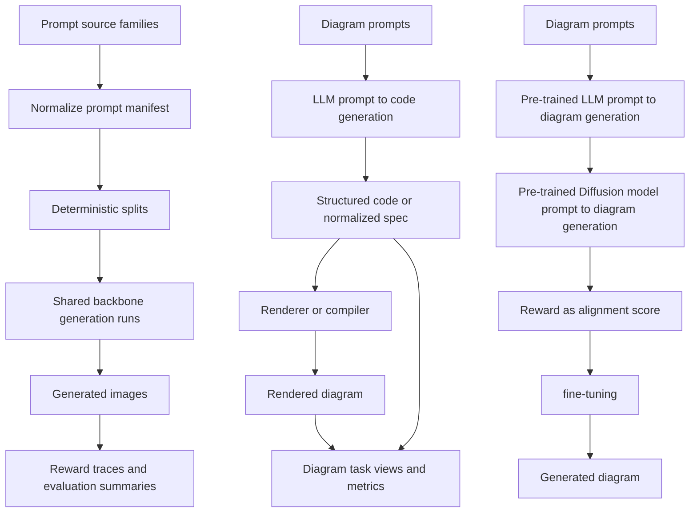

<!-- markdownlint-disable-file -->
# Task Research: Data Strategy for Clover Baselines

Define a data strategy for the repository's first research milestone: identify a common subset of data that can support baseline experiments for the diffusion-model reinforcement-learning papers referenced in README.md, while also defining a structured prompt-to-diagram dataset track for graphs and flowcharts.

## Task Implementation Requests

* Define dataset definitions for the project
* Define a dataset creation strategy for a shared baseline subset
* Define dataset inputs and outputs for training and evaluation
* Extend the strategy to cover graph, flowchart, and prompt-to-diagram data

## Scope and Success Criteria

* Scope: Research the repository structure, the baseline papers listed in README.md, and the CVPR 2025 text-to-diagram benchmark referenced for structured diagrams. Recommend a shared dataset strategy for initial baseline runs plus a prompt-to-diagram dataset strategy for graph and flowchart tasks. Excludes implementation code changes outside this research document.
* Assumptions:
  * The repository is at an early setup stage with directories already created.
  * The codebase will be incrementally built into modules, with clover/data owning shared dataset abstractions and clover/baselines owning baseline implementations.
  * The first milestone is comparability across baselines, not full-scale reproduction of every paper.
  * The project can start from a public pretrained Stable Diffusion checkpoint for RL baselines.
  * Large raw assets should be treated as external artifacts rather than committed to Git.
* Success Criteria:
  * Define candidate datasets and the role each plays.
  * Recommend one practical dataset creation strategy for a common subset.
  * Specify dataset inputs, outputs, and artifact boundaries clearly enough to guide implementation.

## Executive Summary

**Current State (as of 2026-07-25):**

All three RL baselines (DDPO, DPOK, B2-DiffuRL) have been implemented using a **config-driven prompt strategy**:

* Prompts stored as `train_prompts: tuple[str, ...]` in dataclass configs (4 clover-themed prompts shared across all baselines).
* Runtime sampling via `sample_prompt_batch` using `random.choice`.
* Rewards computed inline using `aesthetic_proxy_reward` (RGB heuristic: brightness, saturation, contrast).
* Outputs saved to `output_dir` with config.json, history.json, LoRA weights, and epoch images.
* **No external data artifacts**: clover/data/ remains empty, no manifest files, no Dataset classes.

**Strengths:**

* Zero data preprocessing, fast iteration, self-contained reproducibility.
* Appropriate for baseline bring-up with small prompt sets.

**Limitations:**

* Prompt duplication across baselines, no provenance tracking, no train/eval splits.
* Single reward function per experiment, practical limit ~10-20 prompts.
* Cannot enforce identical prompt sequences for fair cross-baseline comparison.

**Evolution Path:**

The current config-driven approach is **sufficient for ongoing exploration** unless transition criteria are met:

* Prompt sets grow beyond 20 prompts.
* Need for cross-baseline comparison on identical prompt sequences.
* Need for multi-scorer evaluation (CLIP, BERT, ImageReward).
* Need for provenance tracking (DDPO overlap, B2 templates, DrawBench).
* Start of diagram generation benchmarks.

When triggered, transition to a **manifest-based data strategy** with:

* JSONL/Parquet prompt manifests in `data/manifests/`.
* Deterministic train/eval splits with provenance metadata.
* Offline multi-scorer reward computation.
* Separate dataset families for RL prompts, structured diagrams, and paired images (future).

This document provides the full evolution roadmap and implementation plan for that transition.

## Outline

* Gather codebase evidence about current data-related structure.
* Review the baseline references for data assumptions and interfaces.
* Review the CVPR 2025 text-to-diagram benchmark for graph and flowchart data implications.
* Evaluate common dataset options for text-to-image diffusion RL baselines.
* Select modular dataset tracks and document rationale, schemas, and next steps.

## Potential Next Research

* Validate exact licensing and redistribution constraints for any future paired caption-image corpus.
  * Reasoning: Stable Diffusion style pretraining requires paired text-image data, and those assets may have different storage constraints than prompt-only RL data.
  * Reference: README.md baseline paper links and dataset provider terms.
* Define the exact reward-scorer set for the first implementation pass.
  * Reasoning: The selected prompt subset is only comparable if reward recomputation is standardized.
  * Reference: DDPO, DPOK, and B2-DiffuRL reward pipelines.
* Validate released file formats and licensing for DiagramGenBenchmark or equivalent upstream diagram-code corpora.
  * Reasoning: The structured-diagram track depends on compiler-backed code artifacts, and those sources may impose different redistribution constraints than prompt manifests.
  * Reference: From Words to Structured Visuals: A Benchmark and Framework for Text-to-Diagram Generation and Editing.

## Research Executed

### File Analysis

**Initial Assessment (outdated):**

* README.md:2 states the repository goal is training diffusion models with reinforcement learning.
* README.md:5-9 identifies the initial baseline set: B2-DiffuRL, Stable Diffusion, DDPO, and DPOK.
* pyproject.toml:4-7 is still scaffold-level, with placeholder description text and `dependencies = []`.
* main.py:2 is a stub that prints `Hello from clover!`.
* clover/utils/utils.py:3-13 contains only notebook autoreload support.
* clover/exp/b2diffurl.ipynb:11 and clover/exp/b2diffurl.ipynb:21-22 show the only active workflow is notebook-based exploration.
* clover/data/ and clover/baselines/ are currently empty, so there is no existing dataset contract to extend.

**Current Implementation (as of 2026-07-25):**

* clover/baselines/ddpo.py, clover/baselines/dpok.py, clover/baselines/b2diffurl.py: All three baselines now have complete runnable implementations.
* All baseline configs use hardcoded `train_prompts` tuples with 4 clover-themed prompts.
* clover/baselines/common.py:22-53 provides shared utilities: parse_config, prepare_output, make_reward_fn, generate_eval_images, and evaluate.
* clover/utils/baseline_utils.py:289-300 implements `sample_prompt_batch` which randomly samples from config prompts at runtime.
* clover/utils/baseline_utils.py:640-653 implements `standard_eval_prompts` which deduplicates config.prompt + train_prompts for evaluation.
* clover/utils/rewards_utils.py:10-24 implements `aesthetic_proxy_reward` as a simple RGB-based heuristic reward function.
* All baselines save outputs to configurable `output_dir` with history.json, config.json, LoRA weights, and generated images per epoch.
* clover/data/ directory still empty - no manifest files, dataset loaders, or external data artifacts implemented yet.
* The implemented strategy is **config-driven** with **in-memory sampling**, not manifest-driven.

### Code Search Results

* Search result summary from subagent inspection: no loaders, manifests, reward records, preprocessing code, split definitions, or dataset schemas were found in the checked-in package.
* The controlling local fact is absence, not conflicting implementations: the data strategy needs to define the first explicit dataset abstraction for the repo.

### Actual Implemented Data Strategy

**Implementation Pattern: Config-Driven with Runtime Sampling**

All three baseline implementations (DDPO, DPOK, B2-DiffuRL) use a unified config-driven data strategy:

**Prompt Management:**

* Prompts defined as `train_prompts: tuple[str, ...]` in config dataclasses.
* Current default: 4 clover-themed prompts shared across all baselines.
* Runtime sampling via `sample_prompt_batch(train_prompts, batch_size)` using `random.choice`.
* No external manifest files, no data/ directory usage, no Dataset abstraction.

**Rollout Collection:**

* `collect_rollouts` (DDPO, DPOK) and `collect_branch_rollouts` (B2-DiffuRL) generate trajectories on-the-fly.
* Images decoded from latents during training using `decode_latents(pipe, latents)`.
* Rewards computed inline using `reward_fn(images, prompts)` which calls `aesthetic_proxy_reward`.
* Rollout returns dict with keys: `prompts`, `states`, `actions`, `old_log_probs`, `timesteps`, `rewards`, `images`.

**Reward Function:**

* Default: `aesthetic_proxy_reward` - RGB heuristic based on brightness (45%), saturation (35%), contrast (20%).
* Passed as callable from `make_reward_fn(device)` in common.py.
* No external reward model loading, no multi-scorer infrastructure yet.

**Output Artifacts:**

* All saved to `output_dir` (default: `outputs/{ddpo,dpok,b2diffurl}`).
* `config.json`: serialized dataclass config using `asdict(config)`.
* `history.json`: list of per-epoch metrics dicts (loss, reward_mean, reward_std, etc.).
* `lora_epoch_{epoch:04d}/`: LoRA adapter weights via `save_lora_weights`.
* `epoch_{epoch:04d}_sample_{index:02d}.png`: generated images per training epoch.
* `eval/`: final evaluation images saved as grid via `save_image_grid_outputs`.

**Evaluation:**

* Uses `standard_eval_prompts(config, limit=4)` which deduplicates `[config.prompt, *train_prompts]`.
* Generates images with fixed seed (123) for reproducibility.
* Saves eval images but does not save eval metrics to file (DDPO, DPOK).
* B2-DiffuRL saves `eval_metrics.json` with per-prompt rewards.

**Configuration Override:**

* CLI args supported via `parse_config`: `--model-id`, `--output-dir`, `--seed`, `--train-epochs`, `--rollouts-per-epoch`, `--learning-rate`, `--gpu-ids`, `--no-mixed-precision`.
* Args override dataclass defaults, enabling quick experimentation.

**Key Characteristics:**

* **Strength**: Simple, self-contained, fast iteration for small prompt sets.
* **Strength**: No external dependencies, no data preprocessing pipeline.
* **Strength**: Reproducible via seed + config.json.
* **Limitation**: Prompts hardcoded in Python, not versioned as data artifacts.
* **Limitation**: No train/eval split enforcement, no stratification, no provenance tracking.
* **Limitation**: Cannot easily scale to hundreds of prompts or multi-source datasets.
* **Limitation**: No reward scorer comparison infrastructure.
* **Limitation**: Each baseline must independently define prompts (currently duplicated across all three).

**Prompt Duplication Evidence:**

All three baselines define identical clover-themed prompts in their configs:

```python
# ddpo.py line 51-56
train_prompts: tuple[str, ...] = (
    "a colorful clover field at sunrise, high detail",
    "a close-up photo of a bright green clover leaf with dew",
    "a small robot holding a clover in a clean studio photo",
    "an impressionist painting of clovers under warm sunlight",
)

# dpok.py line 51-56 (identical)
train_prompts: tuple[str, ...] = (
    "a colorful clover field at sunrise, high detail",
    "a close-up photo of a bright green clover leaf with dew",
    "a small robot holding a clover in a clean studio photo",
    "an impressionist painting of clovers under warm sunlight",
)

# b2diffurl.py line 51-56 (identical)
train_prompts: tuple[str, ...] = (
    "a colorful clover field at sunrise, high detail",
    "a close-up photo of a bright green clover leaf with dew",
    "a small robot holding a clover in a clean studio photo",
    "an impressionist painting of clovers under warm sunlight",
)
```

This duplication is acceptable for early exploration but becomes a maintenance burden and prevents fair cross-baseline comparison.

**Transition Triggers:**

The current config-driven approach should transition to manifest-based when:

1. Prompt sets grow beyond ~20 prompts per baseline.
2. Need for deterministic train/eval splits across runs.
3. Need to compare multiple reward scorers (CLIP, BERT, ImageReward, Aesthetic).
4. Need to track prompt provenance (DDPO overlap, B2 templates, DrawBench).
5. Need to share prompt sets across baseline implementations.
6. Need to version prompt datasets independently from code.
7. Need to support external prompt contributions without code changes.

### External Research

* Stable Diffusion / LDM requires paired text-image data for base-model training, with official SD v1 training tied to LAION-5B subsets and related caption-image corpora.
  * Source: [Stable Diffusion v1 model card](https://github.com/CompVis/stable-diffusion/blob/main/Stable_Diffusion_v1_Model_Card.md)
  * Source: [CompVis stable-diffusion repository](https://github.com/CompVis/stable-diffusion)
  * Source: [CompVis latent-diffusion repository](https://github.com/CompVis/latent-diffusion)
* DDPO assumes a pretrained text-to-image model and performs RL fine-tuning from prompts, generated images, and task-specific reward signals.
  * Source: [DDPO paper](https://arxiv.org/html/2305.13301v4)
  * Source: [DDPO project site](https://rl-diffusion.github.io/)
* B2-DiffuRL also assumes a pretrained Stable Diffusion v1.4 checkpoint and uses prompt-only candidate sets plus generated trajectories and alignment rewards.
  * Source: [B2-DiffuRL paper](https://arxiv.org/html/2503.11240v2)
  * Source: [B2-DiffuRL arXiv abstract](https://arxiv.org/abs/2503.11240)
* DPOK uses prompt-only RL fine-tuning on top of a pretrained diffusion backbone, with ImageReward or related learned reward models as the practical reward interface.
  * Source: [DPOK abstract](https://arxiv.org/abs/2305.16381)
  * Source: [DPOK repository README](https://github.com/google-research/google-research/tree/master/dpok)
  * Source: [DPOK DrawBench prompt metadata](https://github.com/google-research/google-research/blob/master/dpok/dataset/drawbench/data_meta.json)
* DiagramGenBenchmark defines a code-centered benchmark for diagram generation, diagram coding, and diagram editing across categories including flowcharts, directed graphs, undirected graphs, model architecture diagrams, and mind maps.
  * Source: [From Words to Structured Visuals: A Benchmark and Framework for Text-to-Diagram Generation and Editing](https://openaccess.thecvf.com/content/CVPR2025/papers/Wei_From_Words_to_Structured_Visuals_A_Benchmark_and_Framework_for_CVPR_2025_paper.pdf)
  * Source: [arXiv HTML](https://arxiv.org/html/2411.11916v1)

### Project Conventions

* Standards referenced: Task Researcher mode requirements.
* Instructions followed: repository-wide VS Code agent instructions and markdown exemptions for `.copilot-tracking/**`.
* File reference style inside this document uses plain-text workspace-relative paths because `.copilot-tracking/**` is intended for agent consumption.

## Key Discoveries

### Project Structure

**Current State:**

The repository has implemented three working baselines without an external data layer:

* **clover/baselines/**: Contains ddpo.py, dpok.py, b2diffurl.py, common.py - all runnable as Python modules.
* **clover/utils/**: Contains baseline_utils.py and rewards_utils.py with shared training and reward utilities.
* **clover/data/**: Remains empty - no dataset loaders, manifest files, or data preprocessing code.
* **clover/exp/**: Notebook experiments remain for exploration.

The architecture is modular at the code level but not yet at the data level:

* **clover/baselines** owns training logic, rollout collection, and policy updates.
* **clover/utils** owns shared utilities like prompt sampling, LoRA loading, reward computation.
* **clover/data** is the planned home for shared dataset contracts but has no implementation yet.

**Architectural Signal:**

The empty clover/data/ directory combined with working baselines indicates:

* **Intentional simplicity**: The config-driven approach was sufficient for initial bring-up.
* **Modularity ready**: The separation of baselines/, utils/, and data/ shows intent for layered architecture.
* **Evolution path**: The data/ directory placeholder signals future dataset abstraction when needed.

The current pattern treats prompts as experiment parameters (like learning_rate or num_steps) rather than external data artifacts. This works well for small-scale exploration but creates the transition triggers documented in "Actual Implemented Data Strategy."

### Implementation Patterns

**Current State (Implemented):**

The repository has progressed from early exploration to working baseline implementations. All three baselines (DDPO, DPOK, B2-DiffuRL) share a unified config-driven architecture:

* **Prompts as config fields**: Each baseline defines `train_prompts` as a tuple in its dataclass config.
* **Runtime sampling**: `sample_prompt_batch` randomly samples prompts from the config tuple during each rollout.
* **Inline reward computation**: Rewards computed on-the-fly using `aesthetic_proxy_reward`, a simple RGB heuristic.
* **Self-contained rollouts**: Each baseline implements its own `collect_rollouts` or `collect_branch_rollouts` that generates states, actions, rewards, and images in one pass.
* **Artifact-centric outputs**: Training produces config.json, history.json, LoRA weights, and epoch images.
* **Shared utilities**: common.py provides make_reward_fn, evaluate, prepare_output, generate_eval_images.
* **No external data layer**: clover/data/ remains empty; no manifest files, Dataset classes, or data loaders.

**Architectural Trade-Offs:**

The current approach optimizes for:

* **Fast iteration**: Change prompts by editing config, no data pipeline rebuild.
* **Self-documentation**: config.json captures full experimental setup.
* **Minimal dependencies**: No dataset library, no external manifests.

But limits:

* **Prompt scalability**: Tuple-based prompts practical only for small sets (~4-10 prompts).
* **Cross-baseline sharing**: Prompts duplicated across ddpo.py, dpok.py, b2diffurl.py configs.
* **Reproducibility across papers**: No provenance tracking for "DDPO overlap" vs "B2 Template 1" prompts.
* **Multi-scorer evaluation**: Single reward function per run; comparing CLIP vs Aesthetic requires separate experiments.

**Evolution Path:**

The baseline papers split into two data regimes:

* **Stable Diffusion / LDM base training**: paired text-image data is fundamental (not yet in scope).
* **DDPO, DPOK, and B2-DiffuRL RL fine-tuning**: prompt lists are the raw input, while generated images and reward traces are derived outputs (current implementation).

The diagram benchmark introduces a third regime:

* **Prompt-to-diagram tasks for graphs and flowcharts**: should be code-centered, not image-centered (future extension).

The project is currently in the second regime with a lightweight config-driven implementation. Transitioning to a manifest-driven architecture (as proposed in later sections) becomes valuable when prompt diversity, cross-baseline sharing, or multi-scorer comparison becomes a bottleneck.

### Complete Examples

**Actual Implemented Config (from ddpo.py, dpok.py, b2diffurl.py):**

```python
@dataclass
class DDPOConfig:
    model_id: str = "runwayml/stable-diffusion-v1-5"
    output_dir: str = "outputs/ddpo"
    seed: int = 17
    gpu_ids: list[int] = field(default_factory=lambda: [0, 1, 2])
    prompt: str = "a colorful clover field at sunrise, high detail"
    negative_prompt: str = "blurry, low quality, distorted"
    train_prompts: tuple[str, ...] = (
        "a colorful clover field at sunrise, high detail",
        "a close-up photo of a bright green clover leaf with dew",
        "a small robot holding a clover in a clean studio photo",
        "an impressionist painting of clovers under warm sunlight",
    )
    # ... training hyperparameters
```

**Actual Runtime Sampling:**

```python
# From baseline_utils.py
def sample_prompt_batch(train_prompts: tuple[str, ...], batch_size: int) -> list[str]:
    return [random.choice(train_prompts) for _ in range(batch_size)]

# Usage in collect_rollouts
prompts = sample_prompt_batch(config.train_prompts, batch_size)
```

**Actual Evaluation Prompts:**

```python
# From baseline_utils.py
def standard_eval_prompts(config: Any, limit: int = 4) -> list[str]:
    prompts = [config.prompt, *list(config.train_prompts)]
    deduped = list(dict.fromkeys(prompts))
    return deduped[:limit]
```

**Actual Reward Computation:**

```python
# From rewards_utils.py
@torch.no_grad()
def aesthetic_proxy_reward(images: list[Image.Image], prompts: list[str], device: torch.device) -> Tensor:
    rewards = []
    for image in images:
        arr = torch.from_numpy(np.asarray(image).astype("float32") / 255.0)
        mean_rgb = arr.mean(dim=(0, 1))
        brightness = arr.mean()
        saturation = (mean_rgb.max() - mean_rgb.min()).clamp_min(0.0)
        contrast = arr.std().clamp_max(0.35)
        rewards.append(0.45 * brightness + 0.35 * saturation + 0.20 * contrast)
    return torch.stack(rewards).to(device)
```

**Actual Output Structure:**

```text
outputs/ddpo/
  config.json                    # asdict(DDPOConfig)
  history.json                   # [{epoch: 1, loss: ..., reward_mean: ...}, ...]
  lora_epoch_0005/               # LoRA adapter weights at epoch 5
    adapter_config.json
    adapter_model.bin
  lora_final/                    # Final LoRA weights after training
    adapter_config.json
    adapter_model.bin
  epoch_0001_sample_00.png       # Generated image from rollout
  epoch_0005_sample_00.png
  eval/                          # Evaluation images
    grid.png
    sample_00.png
    sample_01.png
```

**Proposed Manifest Record (Future Evolution):**

```text
Canonical prompt record for manifest-based approach

prompt_id: b2_t1_dog_riding_bike_0001
prompt_text: a dog riding a bike
source_family: b2_template1
semantic_tag: activity
split: train
overlap_slice: ddpo_b2_shared
source_paper: b2diffurl_cvpr2025
notes: direct overlap with DDPO animal-activity family
```

### API and Schema Documentation

Recommended canonical raw schema for the first milestone:

* `prompt_id`: stable unique identifier for one canonical prompt record.
* `prompt_text`: the exact text sent to the diffusion pipeline.
* `source_family`: origin of the prompt family, such as `ddpo_animals`, `b2_template1`, `b2_template2`, `b2_template3`, or `dpok_drawbench`.
* `semantic_tag`: task grouping such as `activity`, `attribute`, `relation`, `color`, `count`, `text`, or `composition`.
* `split`: deterministic split label such as `train`, `eval_in_domain`, or `eval_generalization`.
* `overlap_slice`: optional marker for exact cross-paper overlap groups such as `ddpo_b2_shared`.
* `source_paper`: provenance marker for reproducibility.
* `license_note`: optional string for downstream governance.
* `metadata`: optional free-form dictionary for prompt-template fields, such as `animal`, `activity`, `object_1`, `predicate`, or `object_2`.

Recommended derived generation schema:

* `run_id`
* `prompt_id`
* `seed`
* `backbone_id`
* `adapter_id`
* `sampler`
* `num_steps`
* `guidance_scale`
* `image_uri`
* `reward_scores`: map keyed by scorer name, such as `clipscore`, `bertscore`, `imagereward`, or `aesthetic`
* `reward_metadata`: intermediate outputs such as VLM caption text when the reward path needs it

Recommended canonical raw schema for the structured-diagram track:

* `diagram_id`: stable identifier for the base diagram artifact.
* `task_type`: `generation`, `coding`, or `editing`.
* `category`: `flowchart`, `directed_graph`, `undirected_graph`, `model_architecture`, `mind_map`, or another supported category.
* `source_language`: `dot`, `tikz`, `latex`, `mermaid`, or other supported DSL.
* `prompt_id`: stable identifier for the natural-language instruction.
* `prompt_text`: natural-language description of the target diagram.
* `source_code`: canonical code or structured specification used to render the diagram.
* `normalized_spec`: optional language-agnostic IR for nodes, edges, layout hints, and labels.
* `renderer`: compiler or renderer used to create the diagram image.
* `renderer_version`: versioned rendering environment.
* `render_config`: layout engine, fonts, compile flags, and related settings.
* `rendered_uri`: pointer to the rendered diagram artifact.
* `split`: deterministic split label.
* `parent_diagram_id`: optional lineage pointer for edit tasks.
* `edit_instruction`: optional modification request for edit tasks.
* `provenance_source`: benchmark or corpus origin.
* `license_note`: upstream licensing note.
* `evaluation_metadata`: code metrics, visual metrics, and error taxonomy tags.

### Configuration Examples

```json
{
  "dataset_name": "clover_shared_rl_subset_v1",
  "canonical_unit": "prompt_record",
  "raw_manifest": "data/manifests/clover_shared_rl_subset_v1/prompts.jsonl",
  "splits": ["train", "eval_in_domain", "eval_generalization"],
  "source_families": [
    "b2_template1",
    "b2_template2",
    "b2_template3"
  ],
  "overlap_slices": [
    "ddpo_b2_shared"
  ],
  "derived_artifacts_root": "data/artifacts/clover_shared_rl_subset_v1/"
}
```

```json
{
  "dataset_name": "clover_structured_diagrams_v1",
  "canonical_unit": "diagram_artifact_record",
  "raw_manifest": "data/manifests/clover_structured_diagrams_v1/diagrams.jsonl",
  "task_views": ["generation", "coding", "editing"],
  "categories": [
    "flowchart",
    "directed_graph",
    "undirected_graph",
    "model_architecture",
    "mind_map"
  ],
  "source_languages": ["dot", "tikz", "latex", "mermaid"],
  "derived_artifacts_root": "data/artifacts/clover_structured_diagrams_v1/"
}
```

## Technical Scenarios

### Current Implementation: Config-Driven Prompt Strategy

**Status: Implemented and Working**

All three baselines use a unified config-driven approach without external data artifacts.

**Requirements:**

* Support rapid iteration during baseline bring-up.
* Keep prompts version-controlled with code.
* Minimize external dependencies.
* Enable CLI overrides for quick experimentation.
* Support deterministic reproducibility via seed + config.

**Architecture:**

Prompts stored as tuple fields in dataclass configs:

```python
train_prompts: tuple[str, ...] = (
    "a colorful clover field at sunrise, high detail",
    "a close-up photo of a bright green clover leaf with dew",
    "a small robot holding a clover in a clean studio photo",
    "an impressionist painting of clovers under warm sunlight",
)
```

Runtime sampling via `sample_prompt_batch(config.train_prompts, batch_size)` using `random.choice`.

Rollout collection generates images and computes rewards inline:

```python
rollout = collect_rollouts(pipe, batch_size, config, device, dtype, generator, reward_fn, vae_scale_factor)
# Returns: prompts, states, actions, old_log_probs, timesteps, rewards, images
```

Outputs saved to `output_dir`:

```text
outputs/{baseline}/
  config.json
  history.json
  lora_epoch_{epoch:04d}/
  epoch_{epoch:04d}_sample_{index:02d}.png
  eval/
```

**Advantages:**

* **Zero data preprocessing**: No manifest files, no loaders, no external dependencies.
* **Self-contained reproducibility**: config.json + seed fully specifies experiment.
* **Fast iteration**: Edit config tuple, run immediately.
* **Version control**: Prompts tracked in Git with code.
* **Simple debugging**: No data pipeline to debug.

**Limitations:**

* **Prompt duplication**: Same clover prompts hardcoded in all three baseline configs.
* **No provenance**: Cannot distinguish "DDPO overlap" vs "B2 Template 1" prompts.
* **No train/eval splits**: Evaluation uses deduplicated train_prompts, not a held-out set.
* **Single reward scorer**: aesthetic_proxy_reward hardcoded; comparing CLIP vs ImageReward requires code changes.
* **Scalability ceiling**: Practical limit ~10-20 prompts before config tuples become unwieldy.
* **No cross-baseline comparison**: Each baseline samples independently; cannot enforce identical prompt sequences.

**When This Approach Is Sufficient:**

* Baseline bring-up and method validation.
* Small prompt sets (< 20 prompts).
* Single reward function per experiment.
* Exploratory experiments prioritizing iteration speed over reproducibility across papers.

**Transition Criteria:**

Move to manifest-based approach when any of these triggers occur:

1. Need to compare 3+ baselines on identical prompt sequences (current: independent sampling).
2. Need to track prompt provenance (DDPO, B2, DrawBench sources).
3. Need deterministic train/eval splits across runs.
4. Need to compare multiple reward scorers (CLIP, BERT, ImageReward, Aesthetic).
5. Prompt sets grow beyond 20 prompts.
6. Need to accept external prompt contributions without code changes.
7. Need to version prompt datasets independently from code.

### Future Evolution: Manifest-Based Dataset Strategy

**Status: Proposed for Future Implementation**

The project should use a modular multi-track data strategy when the config-driven approach hits its limitations.

Track 1 is the selected RL baseline milestone and should be treated as canonical for diffusion RL experiments:

* A prompt-centric shared RL subset built from B2-DiffuRL prompt templates.
* Template 1 must be preserved as an explicit DDPO/B2 overlap slice.
* Generated images, rewards, captions, and rollout traces are derived artifacts, not raw dataset records.

Track 2 is a structured-diagram dataset family for graphs and flowcharts:

* A prompt-to-code-to-diagram dataset where the structured code or spec is the raw artifact and the rendered diagram is a deterministic projection.
* Graph and flowchart prompts should preserve logical structure through code generation rather than direct prompt-to-image generation.
* The same base artifact store should support generation, coding, and editing task views.

Track 3 is a future extension, not part of the first milestone:

* A paired caption-image corpus for any later effort that needs Stable Diffusion style supervised training or strict all-paper data unification.

**Requirements:**

* Support the baseline set named in README.md.
* Support incremental implementation as shared modules in clover/data and baseline modules in clover/baselines.
* Enable a common subset for fast iteration and controlled comparisons.
* Keep preprocessing and storage boundaries explicit.
* Avoid forcing Stable Diffusion pretraining assumptions into the first RL comparison milestone.
* Preserve logical structure for graph and flowchart datasets through compiler-backed structured representations.

**Preferred Approach:**

* Use the B2-DiffuRL three-template prompt suite as the canonical raw subset for the first milestone.
* Encode Template 1 animal-activity prompts as a named overlap slice because that is the cleanest direct intersection with DDPO.
* Start all RL baselines from the same pretrained Stable Diffusion checkpoint and recompute rewards from shared generated outputs.
* Add a separate structured-diagram dataset family whose canonical raw unit is a compiler-backed diagram artifact, not a flat prompt-image pair.

```text
Recommended artifact boundary

raw source prompts
  -> normalized prompt manifest
    -> deterministic split manifests
      -> generated image artifacts per run
        -> reward traces per scorer
          -> evaluation summaries

raw prompt + structured diagram specification
  -> normalized diagram artifact manifest
    -> renderer/compiler-backed outputs
      -> task views: generation, coding, editing
        -> code metrics + image metrics + error tags
```


```mermaid
flowchart TD
  A[Prompt source families] --> B[Normalize prompt manifest]
  B --> C[Deterministic splits]
  C --> D[Shared backbone generation runs]
  D --> E[Generated images]
  E --> F[Reward traces and evaluation summaries]

  G[Diagram prompts] --> H[LLM prompt to code generation]
  H --> I[Structured code or normalized spec]
  I --> J[Renderer or compiler]
  J --> K[Rendered diagram]
  K --> L[Diagram task views and metrics]
  I --> L

  M[Diagram prompts] --> N[Pre-trained LLM prompt to diagram generation]
  N --> O[Pre-trained Diffusion model prompt to diagram generation]
  O --> P[Reward as alignment score]
  P --> Q[fine-tuning]
  Q --> R[Generated diagram]
```

**Implementation Details:**

Dataset definitions:

* `clover_shared_rl_subset_v1`
  * Canonical raw unit: prompt record.
  * Scope: first-pass shared dataset for DDPO, DPOK, and B2-DiffuRL style experiments.
  * Contents: B2 Template 1, Template 2, and Template 3 prompts normalized into one manifest.
  * Special slice: `ddpo_b2_shared` for Template 1 animal-activity prompts.
* `clover_paired_pretrain_extension_v1`
  * Canonical raw unit: prompt-image pair.
  * Scope: optional future extension if the project later needs supervised training or strict inclusion of Stable Diffusion training assumptions.
  * Status: defer until the repository actually needs this path.
* `clover_structured_diagrams_v1`
  * Canonical raw unit: compiler-backed diagram artifact record.
  * Scope: shared dataset family for prompt-to-diagram, diagram-to-code, and edit-based benchmarks involving flowcharts and graphs.
  * Contents: prompt, code or structured spec, render configuration, rendered artifact, lineage, and evaluation metadata.
  * Initial categories: `flowchart`, `directed_graph`, `undirected_graph`, with optional expansion to `model_architecture` and `mind_map`.

Dataset creation strategy:

1. Normalize prompts from the selected source families into a single canonical manifest.
2. Preserve provenance fields so each prompt can be traced back to DDPO overlap, B2 template family, or future DPOK imports.
3. Define deterministic split manifests before any model runs. Keep split generation independent from reward scores.
4. Generate outputs from a shared pretrained backbone using fixed seeds and saved inference metadata.
5. Compute reward traces as separate, reproducible artifacts so one prompt manifest can be reused across scorers and baselines.
6. Add DPOK DrawBench prompts only as a later expansion set if broader prompt diversity is required.
7. For structured diagrams, use prompt-to-code generation as the canonical creation path when the target semantics are logical, relational, or procedural.
8. Store generated code or normalized structured specs as first-class artifacts, then compile or render them into diagrams.
9. Expose the same underlying diagram artifact as multiple task projections: prompt-to-code-to-diagram generation, diagram-to-code reconstruction, and instruction-based diagram editing.

Dataset inputs and outputs:

* Inputs to canonical raw dataset creation:
  * paper-defined prompt lists
  * prompt template metadata
  * split definitions
  * provenance and licensing notes
* Outputs from canonical raw dataset creation:
  * normalized prompt manifest in JSONL or Parquet
  * deterministic split manifests
  * subset metadata and version identifier
* Inputs to experiment-time derived artifact generation:
  * canonical prompt manifest
  * shared pretrained backbone identifier
  * sampling configuration
  * reward scorer configuration
* Outputs from experiment-time derived artifact generation:
  * generated images
  * reward traces per scorer
  * optional VLM captions or intermediate descriptions
  * aggregate evaluation tables
* Inputs to structured-diagram dataset creation:
  * natural-language diagram prompts
  * benchmark- or author-provided source code when available
  * source language and renderer configuration
  * category labels and lineage metadata
  * edit instructions for editing tasks
* Outputs from structured-diagram dataset creation:
  * normalized diagram artifact manifest
  * code or normalized structured specs
  * rendered diagrams
  * task-view manifests for generation, coding, and editing
  * code metrics, image metrics, and error taxonomy annotations

Recommended storage layout:

```text
data/
  manifests/
    clover_shared_rl_subset_v1/
      prompts.jsonl
      split_train.jsonl
      split_eval_in_domain.jsonl
      split_eval_generalization.jsonl
      dataset_card.json
    clover_structured_diagrams_v1/
      diagrams.jsonl
      generation_view.jsonl
      coding_view.jsonl
      editing_view.jsonl
      dataset_card.json
  artifacts/
    clover_shared_rl_subset_v1/
      <run_id>/
        generations/
        rewards/
        metrics/
    clover_structured_diagrams_v1/
      <diagram_id>/
        source/
        renders/
        metrics/
        lineage/
```

Recommended file format choice:

* Start with JSONL for the canonical manifests because the repository is still in early modular build-out and JSONL keeps ingestion and validation simple.
* Promote to Parquet later if prompt volume, join-heavy analysis, or columnar scans become a bottleneck.

Recommended initial prompt coverage:

* Include all three B2 template families in the canonical manifest.
* Treat Template 1 as the default first benchmark slice for method bring-up because it overlaps most cleanly with DDPO.
* Keep room for a future `dpok_drawbench_extension` family rather than mixing it into v1 immediately.
* For structured diagrams, start with `flowchart` and `directed_graph` as the highest-value initial categories, then extend to `undirected_graph` after confirming dataset coverage is sufficient.

Why this is the selected approach:

* It matches the actual repository maturity level: there is no data stack to retrofit.
* It matches the practical common denominator across the RL baselines: prompts are raw inputs, rewards and images are derived outputs.
* It preserves the strongest exact overlap between DDPO and B2-DiffuRL while still giving broader compositional coverage than the DDPO-only animal set.
* It matches the structured-diagram benchmark evidence: graph and flowchart tasks are best represented as prompt-to-code-to-diagram pipelines, not flat prompt-to-image pairs.
* It aligns with the intended modular architecture, where clover/data owns shared dataset families and clover/baselines builds method-specific logic on top.
* It avoids the storage and licensing burden of paired image corpora before the project has a concrete need for Stable Diffusion pretraining experiments.

```json
{
  "prompt_id": "b2_t3_cat_left_of_couch_0003",
  "prompt_text": "a cat to the left of a couch",
  "source_family": "b2_template3",
  "semantic_tag": "relation",
  "split": "eval_generalization",
  "overlap_slice": null,
  "source_paper": "b2diffurl_cvpr2025",
  "license_note": "paper prompt list",
  "metadata": {
    "object_1": "cat",
    "predicate": "left of",
    "object_2": "couch"
  }
}
```

```json
{
  "diagram_id": "flowchart_approval_0012",
  "task_type": "generation",
  "category": "flowchart",
  "source_language": "dot",
  "prompt_id": "flowchart_prompt_0012",
  "prompt_text": "Create a flowchart for a purchase approval process with a start node, approval decision, manager review path, and terminal outcomes.",
  "source_code": "digraph PurchaseApproval { rankdir=TB; Start -> Submit; Submit -> Review; Review -> Approved [label=\"yes\"]; Review -> Rejected [label=\"no\"]; }",
  "normalized_spec": {
    "nodes": ["Start", "Submit", "Review", "Approved", "Rejected"],
    "edges": [
      ["Start", "Submit"],
      ["Submit", "Review"],
      ["Review", "Approved", "yes"],
      ["Review", "Rejected", "no"]
    ]
  },
  "renderer": "graphviz",
  "renderer_version": "9.x",
  "rendered_uri": "data/artifacts/clover_structured_diagrams_v1/flowchart_approval_0012/renders/main.png",
  "split": "train",
  "provenance_source": "diagramgenbenchmark",
  "license_note": "upstream benchmark terms",
  "evaluation_metadata": {
    "codebleu": null,
    "clip_fid": null,
    "error_tags": []
  }
}
```

Prompt-to-diagram pipeline assumption:

* For graph and flowchart data, use a language model to translate the prompt into diagram code or a normalized structured spec.
* Render the code into a diagram artifact using a deterministic compiler or renderer.
* Evaluate both the structured output and the rendered output because logical correctness can be preserved in code even when a direct image-generation pipeline would blur structural constraints.

#### Considered Alternatives

Alternative 1: Use DDPO animal-activity prompts only.

* Benefit: this is the simplest exact overlap between DDPO and B2-DiffuRL.
* Reason not selected: it is too narrow for a project-level shared subset and undercovers attributes and relations.
* Evidence: DDPO and B2-DiffuRL both use the 45-animal, 3-activity family, but B2 adds Template 2 and Template 3 specifically to broaden alignment behavior.

Alternative 2: Use DPOK's four-prompt or DrawBench-centered prompt pools as the primary subset.

* Benefit: this is DPOK-friendly and remains prompt-only.
* Reason not selected: the overlap with DDPO and B2-DiffuRL is weaker, and the four-prompt setup is too small to define the project's first common subset.
* Evidence: DPOK exposes prompt-only training surfaces, but its prompt families are not the cleanest anchor for cross-paper overlap.

Alternative 3: Use a paired caption-image corpus from day one.

* Benefit: this is the strict common denominator across all four papers if Stable Diffusion pretraining is treated as an in-scope baseline.
* Reason not selected: it adds licensing, storage, and preprocessing complexity that the first milestone does not need.
* Evidence: the local repository has no paired-data pipeline, and the RL baselines can already be compared from prompt-only data plus derived rewards.

Alternative 4: Model graph and flowchart tasks as direct prompt-to-image examples only.

* Benefit: a direct image-generation formulation is simpler on paper.
* Reason not selected: it loses the explicit logical structure required by graphs and flowcharts, making code-level validation and reversible editing much weaker.
* Evidence: the CVPR 2025 DiagramGenBenchmark is built around code intermediates, compiler-backed rendering, and task formulations that move through structured representations.

## Selected Approach Summary

**Current Implementation (Implemented):**

All three baselines use a **config-driven prompt strategy** without external data artifacts:

* Prompts defined as `train_prompts: tuple[str, ...]` in dataclass configs.
* Runtime sampling via `sample_prompt_batch(config.train_prompts, batch_size)`.
* Rewards computed inline using `aesthetic_proxy_reward` (RGB heuristic).
* Outputs saved to `output_dir` with config.json, history.json, LoRA weights, epoch images.
* clover/data/ remains empty.

**Strengths:**

* Fast iteration, zero data preprocessing, self-contained reproducibility.
* Appropriate for baseline bring-up with small prompt sets (current: 4 prompts).

**Limitations:**

* Prompt duplication across baselines, no provenance tracking, no train/eval splits.
* Single reward function, practical limit ~10-20 prompts.

**Evolution Path (Proposed for Future):**

When transition criteria are met (prompt scaling, cross-baseline comparison, multi-scorer evaluation, provenance tracking), implement a **modular manifest-based data strategy** with separate first-class dataset families:

* Build `clover_shared_rl_subset_v1` from the B2-DiffuRL three-template suite.
* Preserve Template 1 as the explicit DDPO/B2 overlap slice.
* Treat RL prompt records as canonical raw data for diffusion RL baselines.
* Build `clover_structured_diagrams_v1` as a separate compiler-backed dataset family for flowcharts and graphs.
* Treat prompt-to-code-to-diagram generation as the canonical pipeline for structured diagrams.
* Treat generated images and reward traces as derived artifacts in the RL track, and treat rendered diagrams as deterministic projections of code artifacts in the diagram track.
* Defer any paired caption-image dataset until the project actually needs Stable Diffusion style supervised training.

The manifest-based approach provides:

* **Provenance tracking**: Distinguish DDPO overlap, B2 templates, DrawBench sources.
* **Deterministic splits**: train/eval/generalization sets defined once, reused across runs.
* **Multi-scorer comparison**: Compute CLIP, BERT, ImageReward, Aesthetic from shared generations.
* **Cross-baseline sharing**: All baselines use identical prompt sequences for fair comparison.
* **Scalability**: Support hundreds of prompts via JSONL/Parquet manifests.
* **External contributions**: Accept new prompts without code changes.

## Key Takeaways

**Current State Assessment:**

The repository has successfully implemented three working RL baselines using a pragmatic config-driven data strategy. This approach was appropriate for baseline bring-up and continues to be sufficient for small-scale exploration.

**No Immediate Action Required:**

The current implementation does not require data strategy changes unless transition criteria are met. The config-driven approach is working as intended.

**Evolution is Staged, Not Urgent:**

The manifest-based architecture documented in this research is the recommended evolution path, but should only be implemented when triggered by concrete needs (prompt scaling, cross-baseline comparison, multi-scorer evaluation, provenance tracking, or diagram benchmarks).

**Design Principles Validated:**

* **Start simple**: Config-driven prompts enabled fast baseline implementation.
* **Defer complexity**: Empty clover/data/ avoided premature abstraction.
* **Share utilities**: common.py and baseline_utils.py provide baseline-agnostic helpers.
* **Version configurations**: config.json captures full experiment setup for reproducibility.

**Architecture Ready for Evolution:**

The separation of clover/baselines, clover/utils, and clover/data (empty) shows intent for layered architecture. When transition criteria are met, the manifest-based approach can be implemented incrementally without disrupting existing baselines.

**Recommendation:**

Continue with config-driven approach for ongoing work. Monitor transition criteria. Implement manifest-based evolution when benefits justify the additional complexity.

## Evidence Log

### Local Repository Evidence (Current Implementation)

* README.md:2 - repository goal
* README.md:5-9 - initial baseline set identification
* clover/baselines/ddpo.py:1-176 - full DDPO implementation with config-driven prompts
* clover/baselines/dpok.py:1-202 - full DPOK implementation with config-driven prompts
* clover/baselines/b2diffurl.py:1-210 - full B2-DiffuRL implementation with config-driven prompts
* clover/baselines/common.py:1-95 - shared utilities (parse_config, prepare_output, make_reward_fn, evaluate)
* clover/utils/baseline_utils.py:289-300 - sample_prompt_batch implementation
* clover/utils/baseline_utils.py:640-653 - standard_eval_prompts implementation
* clover/utils/rewards_utils.py:10-24 - aesthetic_proxy_reward implementation
* clover/baselines/ddpo.py:51-56, dpok.py:51-56, b2diffurl.py:51-56 - identical train_prompts across all baselines
* clover/data/ - empty directory, no dataset implementations
* pyproject.toml:4-7 - project metadata
* main.py:2 - minimal entrypoint
* clover/exp/ - experimental notebooks

### External Evidence

* [Stable Diffusion v1 model card](https://github.com/CompVis/stable-diffusion/blob/main/Stable_Diffusion_v1_Model_Card.md)
* [CompVis stable-diffusion repository](https://github.com/CompVis/stable-diffusion)
* [CompVis latent-diffusion repository](https://github.com/CompVis/latent-diffusion)
* [DDPO paper](https://arxiv.org/html/2305.13301v4)
* [DDPO project site](https://rl-diffusion.github.io/)
* [B2-DiffuRL paper](https://arxiv.org/html/2503.11240v2)
* [B2-DiffuRL arXiv abstract](https://arxiv.org/abs/2503.11240)
* [DPOK abstract](https://arxiv.org/abs/2305.16381)
* [DPOK repository README](https://github.com/google-research/google-research/tree/master/dpok)
* [DPOK DrawBench prompt metadata](https://github.com/google-research/google-research/blob/master/dpok/dataset/drawbench/data_meta.json)
* [From Words to Structured Visuals: A Benchmark and Framework for Text-to-Diagram Generation and Editing](https://openaccess.thecvf.com/content/CVPR2025/papers/Wei_From_Words_to_Structured_Visuals_A_Benchmark_and_Framework_for_CVPR_2025_paper.pdf)
* [Diagram benchmark research note](.copilot-tracking/research/subagents/2026-06-14/diagram-benchmark-research.md)

## Actionable Next Steps for Implementation

### Immediate Actions (Current State Sufficient)

The config-driven approach is working well for baseline bring-up. No immediate data strategy changes required unless transition criteria are met.

**Optional Improvements:**

1. **Deduplicate prompts**: Extract shared `train_prompts` to clover/utils/prompts.py to avoid duplication across baseline configs.
2. **Add eval split**: Define separate `eval_prompts` tuple in configs distinct from `train_prompts`.
3. **Reward abstraction**: Allow `reward_fn` to be configurable via config (e.g., `reward_type: str = "aesthetic"`).

### Transition Roadmap (When Criteria Are Met)

**Phase 1: Minimal Manifest Layer (1-2 weeks)**

Implement lightweight manifest support while preserving config-driven defaults:

1. Create `clover/data/prompts.py` with `PromptDataset` class that can load from JSONL or use config tuples.
2. Create `data/manifests/shared_v1/prompts.jsonl` with B2 Template 1, 2, 3 prompts and provenance metadata.
3. Update baseline configs to optionally load from `prompt_manifest_path: str | None = None`.
4. Keep config tuple as default fallback for backward compatibility.
5. Add `--prompt-manifest` CLI arg to `parse_config` in common.py.

**Phase 2: Multi-Scorer Evaluation (2-3 weeks)**

Decouple reward computation from rollout collection:

1. Materialize the prompt manifest for `clover_shared_rl_subset_v1` under `data/manifests/`.
2. Encode deterministic split files: `split_train.jsonl`, `split_eval_in_domain.jsonl`, `split_eval_generalization.jsonl`.
3. Define one run manifest schema for generated outputs and reward traces in `data/artifacts/`.
4. Implement `clover/utils/rewards_utils.py` with multi-scorer support (CLIP, BERT, ImageReward, Aesthetic).
5. Create offline reward computation script: `python -m clover.utils.compute_rewards --run-id <id> --scorers clip,bert,aesthetic`.
6. Update evaluation to load and compare multi-scorer results.

**Phase 3: Structured Diagrams (4-6 weeks, parallel to Phase 2)**

Implement diagram track as separate dataset family:

1. Materialize a diagram artifact schema for `clover_structured_diagrams_v1` under `data/manifests/`.
2. Start with `flowchart` and `directed_graph` task views as initial categories.
3. Standardize one prompt-to-code renderer toolchain (Graphviz for dot, TikZ compiler for LaTeX).
4. Create `clover/data/diagrams.py` with `DiagramDataset` class for code-to-render pipelines.
5. Add evaluation metrics for code correctness (CodeBLEU) and visual quality (CLIP-FID).

**Phase 4: Full Manifest-Based Architecture (ongoing)**

Complete transition to manifest-first architecture:

1. Define `clover/data/base.py` with abstract `Dataset` interface.
2. Implement `PromptDataset`, `DiagramDataset`, `PairedImageDataset` (future) as concrete implementations.
3. Add versioning and dataset cards to manifests.
4. Deprecate config tuple approach, require manifest paths in all baselines.
5. Add data preprocessing and validation scripts under `scripts/data/`.
6. Document dataset creation guide in `docs/datasets.md`.

### Decision Points

**Trigger 1: Prompt Scaling**

If prompt sets grow beyond 20 prompts, start Phase 1 immediately.

**Trigger 2: Cross-Baseline Comparison**

If need to run fair comparisons across DDPO/DPOK/B2-DiffuRL with identical prompt sequences, start Phase 1.

**Trigger 3: Multi-Scorer Evaluation**

If need to compare CLIP vs ImageReward vs Aesthetic, start Phase 2.

**Trigger 4: Provenance Tracking**

If need to distinguish DDPO overlap vs B2 templates vs DrawBench prompts, start Phase 1.

**Trigger 5: Diagram Benchmarks**

If starting work on graph/flowchart generation, start Phase 3.

**No Immediate Action Required:**

If continuing with small-scale exploration (< 20 prompts, single reward function, independent baseline runs), the current config-driven approach is sufficient.