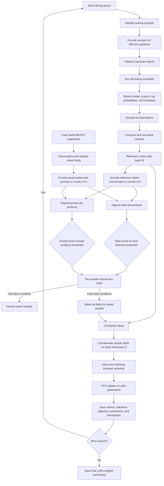
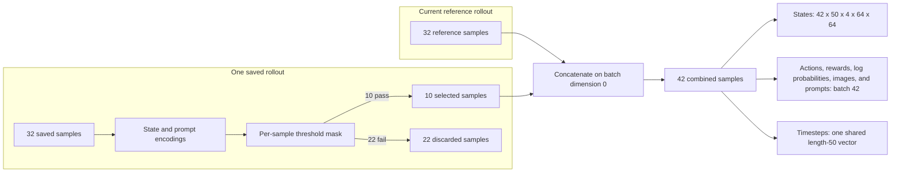

# MD3PO Baseline

MD3PO in this repository extends denoising diffusion policy optimization with replay samples selected for prompt relevance and trajectory diversity.

## How the method works

- Loads Stable Diffusion v1.5 and trains LoRA adapters on the UNet attention projections.
- Samples a batch of training prompts and encodes them for classifier-free guidance.
- Initializes one Gaussian latent per prompt and executes the configured diffusion scheduler.
- Records each denoising transition as:
  - `states`: latent before the scheduler step, shaped `[batch, steps, channels, height, width]`.
  - `actions`: latent after the scheduler step with the same leading batch and step dimensions.
  - `old_log_probs`: transition log probabilities used by PPO.
  - `timesteps`: the scheduler timestep shared by every sample.
  - `rewards`: zero at intermediate steps and the configured image reward at the terminal step, followed by normalization.
  - `images` and `prompts`: decoded terminal images and their conditioning text.
- Treats the newly collected batch as the reference rollout.
- Loads prior MD3PO trajectories from `clover/data/md3po/trajectories.pt` when that file exists.
- Accepts both live rollout field names such as `states` and saved field names such as `state`, then converts the result back to the live training format.
- Encodes complete state trajectories by flattening each sample, converting it to CPU `float32`, and L2-normalizing it.
- Encodes prompts using normalized CLIP text embeddings from `clover/utils/rewards_utils.py`.
- Processes both state and prompt encodings in sub-batches of four to bound peak memory use.
- Compares aligned reference and saved samples with dot products:
  - State score: `dot(reference_state_encoding[i], saved_state_encoding[i])`.
  - Prompt score: `dot(reference_prompt_encoding[i], saved_prompt_encoding[i])`.
  - Because both encodings are normalized, each dot product is a cosine-similarity score.
- Retains saved sample `i` only when both conditions pass:
  - `state_score[i] <= diversity_threshold`, selecting a sufficiently different trajectory.
  - `prompt_score[i] >= prompt_similarity_threshold`, selecting a sufficiently related prompt.
- Applies the filter independently to every sample rather than accepting or rejecting an entire saved rollout.
- Concatenates accepted samples after the complete reference batch on batch dimension `0` for states, actions, rewards, old log probabilities, images, and prompts.
- Preserves a single shared timestep vector and rejects saved rollouts with a different timestep schedule.
- Produces a combined state tensor shaped `[reference_batch + accepted_samples, steps, channels, height, width]`. For example, `[32, 50, 4, 64, 64]` plus 10 accepted samples becomes `[42, 50, 4, 64, 64]`.
- Runs the shared clipped PPO update over the combined rollout and updates only the trainable LoRA parameters.
- Saves the newly collected reference rollout, rather than the replay-augmented batch, for use by later epochs.
- Writes training history and metrics under `outputs/md3po`, trajectories under `clover/data/md3po`, periodic evaluation results under `outputs/md3po/evals`, and LoRA checkpoints under `outputs/md3po`.

## Logical flow

## Combined-rollout example

## Important implementation constraints

- A saved rollout must have the same full state shape as the reference rollout before filtering.
- Prompt count must equal state batch size.
- All tensor fields other than `timesteps` must expose the same leading batch dimension.
- Lower state similarity is interpreted as greater diversity; higher prompt similarity is interpreted as better semantic alignment.
- The training loop currently calls the combiner with `diversity_threshold=0.5`; the function default for `prompt_similarity_threshold` is `0.9`.
